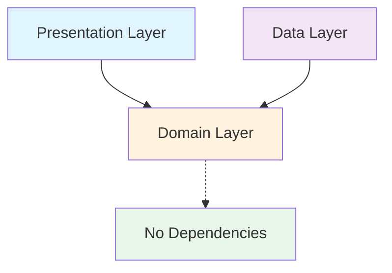

GemAI follows Clean Architecture principles combined with the MVVM (Model-View-ViewModel) pattern, creating a scalable and maintainable Android application. This architecture separates concerns into distinct layers, making the codebase testable and easy to extend.

## Clean Architecture layers

The application is organized into three primary layers, each with specific responsibilities:

<AccordionGroup>
  <Accordion title="Presentation layer" icon="mobile">
    Contains all UI-related code including Jetpack Compose screens, ViewModels, and UI state management.
    
    **Location:** `presentation/`
    
    **Key components:**
    - Composable UI screens (`presentation/screen/`)
    - ViewModels extending `BaseViewModel` (`presentation/screen/*/viewmodel/`)
    - UI state, events, and actions
    - Navigation graphs (`navigation/graph/`)
  </Accordion>

  <Accordion title="Domain layer" icon="cube">
    The core business logic layer containing use cases, repository interfaces, and domain models. This layer has no Android dependencies.
    
    **Location:** `domain/`
    
    **Key components:**
    - Use cases implementing `BaseUseCase` (`domain/use_case/`)
    - Repository interfaces (`domain/repository/`)
    - Domain models (`domain/model/`)
    - Business logic and validation
  </Accordion>

  <Accordion title="Data layer" icon="database">
    Manages data sources including Room database, DataStore, and external APIs. Implements repository interfaces from the domain layer.
    
    **Location:** `data/`
    
    **Key components:**
    - Repository implementations
    - Room database and DAOs (`data/local/dao/`)
    - Entity models (`data/local/model/`)
    - Mappers for data transformation (`data/local/mapper/`)
  </Accordion>
</AccordionGroup>

## Project structure

Here's the complete directory structure of GemAI:

```plaintext
com.sarath.gem/
├── core/
│   ├── ai/                    # AI model abstractions
│   │   ├── BaseAIModel.kt
│   │   ├── GemAIModel.kt     # Main chat AI model
│   │   ├── SystemAIModel.kt  # System-level AI tasks
│   │   └── ModelBuilder.kt
│   ├── base/                  # Base classes and interfaces
│   │   ├── BaseViewModel.kt
│   │   ├── BaseUseCase.kt
│   │   ├── BaseDao.kt
│   │   └── BaseMapper.kt
│   └── util/                  # Utility classes
├── data/
│   ├── local/
│   │   ├── dao/              # Room DAOs
│   │   ├── mapper/           # Entity-to-Domain mappers
│   │   ├── model/            # Room entities
│   │   └── AppDatabase.kt
│   └── remote/               # API models
├── di/                        # Hilt dependency injection modules
│   ├── AppModule.kt
│   ├── RepositoryModule.kt
│   ├── DispatcherModule.kt
│   └── CoroutineScopesModule.kt
├── domain/
│   ├── model/                # Domain models
│   ├── repository/           # Repository interfaces
│   └── use_case/
│       ├── chat/             # Chat-related use cases
│       └── api_key/          # API key use cases
├── navigation/               # Navigation setup
│   └── graph/
└── presentation/
    ├── screen/               # Composable screens
    │   ├── chat/
    │   └── onboarding/
    ├── theme/                # Material 3 theming
    └── util/                 # UI utilities
```

## MVVM pattern implementation

GemAI uses the MVVM pattern with Unidirectional Data Flow (UDF) for predictable state management:

<CodeGroup>
```kotlin BaseViewModel.kt
abstract class BaseViewModel<State : UIState, Event : UIEvent, Action : UIAction>() : ViewModel() {
    private val initialState: State by lazy { initialState() }
    abstract fun initialState(): State
    protected abstract fun onActionEvent(action: Action)

    private val _uiState = MutableStateFlow(initialState)
    val uiState: StateFlow<State> = _uiState.asStateFlow()
    
    private val _uiEventFlow = Channel<Event>(capacity = Channel.BUFFERED)
    val uiEvent = _uiEventFlow.receiveAsFlow()

    protected val currentState: State
        get() = uiState.value

    protected fun update(updatedState: State.() -> State) = _uiState.update(updatedState)
    
    protected fun sendOneTimeUIEvent(event: Event, delayMillis: Long? = null) {
        launch {
            delayMillis?.let { delay(it) }
            _uiEventFlow.send(event)
        }
    }

    fun onAction(action: Action) {
        onActionEvent(action)
    }
}
```

```kotlin ChatViewModel.kt
@HiltViewModel
class ChatViewModel @Inject constructor(
    private val createConversationUseCase: CreateConversationUseCase,
    private val sendMessageUseCase: SendMessageUseCase,
    private val getConversationMessagesUseCase: GetConversationMessagesUseCase,
    // ... other use cases
) : BaseViewModel<ChatUIState, ChatUIEvent, ChatUIAction>() {

    override fun initialState(): ChatUIState {
        return ChatUIState(
            prompt = "",
            chat = emptyList(),
            chats = emptyList(),
            isLoading = false,
            chatId = null,
            startupPrompts = emptyList(),
        )
    }

    override fun onActionEvent(action: ChatUIAction) {
        when (action) {
            ChatUIAction.Submit -> submit()
            is ChatUIAction.SetPrompt -> update { copy(prompt = action.prompt) }
            is ChatUIAction.SetChatId -> switchChat(chatId = action.chatId)
            // ... handle other actions
        }
    }
}
```
</CodeGroup>

<Info>
  **Unidirectional Data Flow** ensures that:
  - **State** flows down from ViewModel to UI
  - **Actions** flow up from UI to ViewModel
  - **Events** are one-time occurrences (navigation, toasts, etc.)
</Info>

## Dependency injection with Hilt

GemAI uses Hilt for dependency injection, providing a clean way to manage dependencies:

<CodeGroup>
```kotlin AppModule.kt
@InstallIn(SingletonComponent::class)
@Module
object AppModule {
    @Provides
    @Singleton
    fun provideLogDao(database: AppDatabase): ConversationDao {
        return database.conversationDao()
    }

    @Provides
    @Singleton
    fun provideMessageDao(database: AppDatabase): MessageDao {
        return database.messageDao()
    }

    @Provides
    @Singleton
    fun providesAppDatabase(@ApplicationContext context: Context): AppDatabase = 
        AppDatabase.getInstance(context)
}
```

```kotlin RepositoryModule.kt
@InstallIn(SingletonComponent::class)
@Module
abstract class RepositoryModule {
    @Binds abstract fun bindDatastoreRepository(impl: DatastoreRepositoryImpl): DatastoreRepository
    @Binds abstract fun bindChatRepository(impl: ChatRepositoryImpl): ChatRepository
    @Binds abstract fun bindApiKeyRepository(impl: ApiKeyRepositoryImpl): ApiKeyRepository
}
```
</CodeGroup>

## Dependency flow

The architecture enforces strict dependency rules:



<Tip>
  **Key principle:** The domain layer has no dependencies on other layers. Presentation and data layers depend on domain, but never on each other directly.
</Tip>

## Next steps

<CardGroup cols={2}>
  <Card title="Core components" icon="puzzle-piece" href="/developer/core-components">
    Learn about base classes, use cases, and AI models
  </Card>
  <Card title="Data layer" icon="database" href="/developer/data-layer">
    Explore Room database, repositories, and data flow
  </Card>
  <Card title="Extending GemAI" icon="code" href="/developer/extending">
    Add new features while maintaining architecture
  </Card>
</CardGroup>