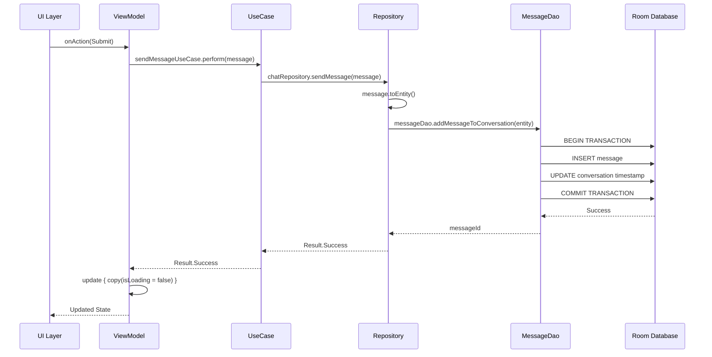

The data layer in GemAI handles all data persistence and retrieval operations using Room Database, DataStore, and the repository pattern. This layer is completely separate from the UI and provides a clean API for the domain layer.

## Room Database setup

GemAI uses Room as its local database solution with three main entities:

```kotlin AppDatabase.kt
@Database(
    entities = [ConversationEntity::class, MessageEntity::class, PromptEntity::class],
    version = 1,
    exportSchema = true,
)
abstract class AppDatabase : RoomDatabase() {
    abstract fun conversationDao(): ConversationDao
    abstract fun messageDao(): MessageDao
    abstract fun promptDao(): PromptDao

    companion object {
        @Volatile private var INSTANCE: AppDatabase? = null

        fun getInstance(context: Context): AppDatabase {
            return INSTANCE ?: synchronized(this) {
                INSTANCE ?: buildDatabase(context = context).also { INSTANCE = it }
            }
        }

        private fun buildDatabase(context: Context): AppDatabase {
            return Room.databaseBuilder(context, AppDatabase::class.java, "gemai.db")
                .fallbackToDestructiveMigration()
                .addCallback(
                    object : Callback() {
                        override fun onCreate(db: SupportSQLiteDatabase) {
                            super.onCreate(db)
                            CoroutineScope(Dispatchers.IO).launch {
                                INSTANCE?.promptDao()?.insertAll(DefaultPrompts)
                            }
                        }
                    }
                )
                .build()
        }
    }
}
```

<Info>
  The database uses a singleton pattern to ensure only one instance exists. On first creation, it pre-populates the database with default prompts.
</Info>

## Database entities

Entities define the database schema and are annotated with Room annotations:

<CodeGroup>
```kotlin ConversationEntity.kt
@Entity(tableName = "conversations")
data class ConversationEntity(
    @PrimaryKey(autoGenerate = true) val id: Long = 0,
    val timestamp: Long,
    val title: String?,
    val lastMessageTimestamp: Long,
    val isUsedForPromptSuggestions: Boolean = false,
)
```

```kotlin MessageEntity.kt
@Entity(
    tableName = "messages",
    foreignKeys = [
        ForeignKey(
            entity = ConversationEntity::class,
            parentColumns = ["id"],
            childColumns = ["conversationId"],
            onDelete = ForeignKey.CASCADE,
        )
    ],
)
data class MessageEntity(
    @PrimaryKey(autoGenerate = true) val id: Long = 0,
    val conversationId: Long,
    val timestamp: Long,
    val content: String,
    val participant: Participant,
    val status: MessageStatus,
)

enum class Participant {
    USER,
    MODEL;

    val role: String
        get() = when (this) {
            USER -> "user"
            MODEL -> "model"
        }
}

enum class MessageStatus {
    LOADING,
    SENT,
    FAILED,
    RECEIVED,
}
```
</CodeGroup>

<Tip>
  Notice the `ForeignKey` constraint on `MessageEntity`. When a conversation is deleted, all associated messages are automatically deleted (CASCADE).
</Tip>

## Data Access Objects (DAOs)

DAOs provide methods to interact with the database. All DAOs extend `BaseDao<T>` for common operations:

### ConversationDao

```kotlin ConversationDao.kt
@Dao
interface ConversationDao : BaseDao<ConversationEntity> {
    @Query("SELECT * FROM conversations") 
    fun getConversations(): Flow<List<ConversationEntity>>

    @Query("SELECT * FROM conversations WHERE id = :id") 
    suspend fun getConversationById(id: Long): ConversationEntity

    @Query("UPDATE conversations SET title = :title WHERE id = :conversationId")
    suspend fun updateTitle(conversationId: Long, title: String)

    @Query("DELETE FROM conversations WHERE id = :conversationId")
    suspend fun deleteConversation(conversationId: Long)

    @Query("UPDATE conversations SET isUsedForPromptSuggestions = :isUsed WHERE id = :conversationId")
    suspend fun setUsedForPromptSuggestions(conversationId: Long, isUsed: Boolean)

    @Query("SELECT conversations.id FROM conversations WHERE isUsedForPromptSuggestions = 0")
    suspend fun getConversationsForPromptSuggestions(): List<Long>
}
```

### MessageDao

```kotlin MessageDao.kt
@Dao
interface MessageDao : BaseDao<MessageEntity> {
    @Query("SELECT * FROM messages WHERE conversationId = :conversationId")
    fun getMessagesForConversation(conversationId: Long): Flow<List<MessageEntity>>

    @Query("SELECT * FROM messages WHERE conversationId = :conversationId")
    suspend fun getMessages(conversationId: Long): List<MessageEntity>

    @Query("SELECT * FROM messages WHERE conversationId = :conversationId AND participant = :participant")
    suspend fun getParticipantMessages(
        conversationId: Long,
        participant: Participant = Participant.USER,
    ): List<MessageEntity>

    @Query("SELECT * FROM messages WHERE id = :id") 
    suspend fun getMessageById(id: Long?): MessageEntity?

    @Query("UPDATE messages SET status = :status WHERE id = :id")
    suspend fun updateMessageStatus(id: Long, status: MessageStatus)

    @Query("UPDATE conversations SET lastMessageTimestamp = :timestamp WHERE id = :conversationId")
    suspend fun updateLastMessageTimestamp(conversationId: Long, timestamp: Long)

    @Transaction
    suspend fun addMessageToConversation(message: MessageEntity): Long {
        val id = insert(message)
        updateLastMessageTimestamp(message.conversationId, message.timestamp)
        return id
    }

    @Transaction
    suspend fun insertOrUpdate(
        id: Long?,
        insert: suspend () -> Unit,
        update: suspend (id: Long, messageContent: String) -> Unit,
    ) {
        if (id == null) {
            insert()
            return
        }
        val message = getMessageById(id)
        if (message == null) {
            insert()
        } else {
            update(id, message.content)
        }
    }

    @Query("SELECT COUNT(*) FROM messages WHERE conversationId = :conversationId")
    suspend fun getMessageCount(conversationId: Long): Int
}
```

<Accordion title="Understanding @Transaction methods">
  The `@Transaction` annotation ensures that multiple database operations execute atomically:

  - `addMessageToConversation()`: Inserts a message and updates the conversation's last message timestamp in a single transaction
  - `insertOrUpdate()`: Checks if a message exists and either inserts or updates accordingly

  If any operation fails, all changes are rolled back.
</Accordion>

## Entity-Domain mappers

Mappers convert between database entities and domain models, keeping layers separate:

```kotlin MessageMapper.kt
object MessageMapper : BaseMapper<MessageEntity, Message> {
    override fun mapToDomain(entity: MessageEntity): Message {
        return with(entity) {
            Message(
                id = id,
                conversationId = conversationId,
                timestamp = timestamp,
                content = content,
                participant = participant,
                status = status,
            )
        }
    }

    override fun mapToEntity(domain: Message): MessageEntity {
        return with(domain) {
            MessageEntity(
                id = id,
                conversationId = conversationId,
                timestamp = timestamp,
                content = content,
                participant = participant,
                status = status,
            )
        }
    }
}

// Convenience extension functions
fun Message.toEntity() = MessageMapper.mapToEntity(this)
fun MessageEntity.toDomain() = MessageMapper.mapToDomain(this)
```

<Info>
  Extension functions like `toEntity()` and `toDomain()` make mapping more concise throughout the codebase.
</Info>

## Repository pattern

Repositories provide a clean API for data access, abstracting the underlying data sources:

### Repository interface

```kotlin ChatRepository.kt (interface)
interface ChatRepository {
    suspend fun createConversation(title: String): Result<Conversation, RequestError>
    
    fun getConversations(): Flow<List<Conversation>>
    
    suspend fun deleteChat(chatId: Long): Result<Unit, RequestError>
    
    suspend fun getConversationById(id: Long): Result<Conversation, RequestError>
    
    fun getConversationMessages(conversationId: Long): Flow<List<Message>>
    
    suspend fun sendMessage(message: Message): Result<Unit, RequestError>
    
    suspend fun getChatHistory(conversationId: Long): Result<List<Message>, RequestError>
    
    suspend fun updateConversationTitle(conversationId: Long, title: String): Result<Unit, RequestError>
    
    suspend fun updateChatTitle(conversationId: Long, prompt: String): Result<Unit, RequestError>
    
    fun getPrompts(): Flow<List<StartUpPrompt>>
}
```

### Repository injection

Repositories are provided through Hilt modules:

```kotlin RepositoryModule.kt
@InstallIn(SingletonComponent::class)
@Module
abstract class RepositoryModule {
    @Binds abstract fun bindDatastoreRepository(impl: DatastoreRepositoryImpl): DatastoreRepository
    @Binds abstract fun bindChatRepository(impl: ChatRepositoryImpl): ChatRepository
    @Binds abstract fun bindApiKeyRepository(impl: ApiKeyRepositoryImpl): ApiKeyRepository
}
```

<Tip>
  Using `@Binds` instead of `@Provides` is more efficient for simple interface-to-implementation mappings.
</Tip>

## Data flow example

Here's how data flows through the layers when sending a message:



<Expandable title="Complete flow with code examples">
  <CodeGroup>
  ```kotlin 1. UI triggers action
  // Composable screen
  Button(onClick = { viewModel.onAction(ChatUIAction.Submit) }) {
      Text("Send")
  }
  ```

  ```kotlin 2. ViewModel calls UseCase
  override fun onActionEvent(action: ChatUIAction) {
      when (action) {
          ChatUIAction.Submit -> {
              viewModelScope.launch {
                  sendMessageUseCase.perform(
                      Message.send(
                          conversationId = currentChatId.value!!,
                          content = currentState.prompt
                      )
                  ).map { update { copy(isLoading = false) } }
              }
          }
      }
  }
  ```

  ```kotlin 3. UseCase delegates to Repository
  class SendMessageUseCase @Inject constructor(
      private val chatRepository: ChatRepository,
      @Dispatcher(GemAIDispatchers.IO) private val dispatcher: CoroutineDispatcher,
  ) : BaseUseCase<Message, Result<Unit, RequestError>> {
      override suspend fun perform(params: Message): Result<Unit, RequestError> =
          withContext(dispatcher) { chatRepository.sendMessage(params) }
  }
  ```

  ```kotlin 4. Repository uses DAO
  class ChatRepositoryImpl @Inject constructor(
      private val messageDao: MessageDao,
      private val gemAIModel: GemAIModel
  ) : ChatRepository {
      override suspend fun sendMessage(message: Message): Result<Unit, RequestError> {
          return try {
              val entity = message.toEntity()
              messageDao.addMessageToConversation(entity)
              Result.Success(Unit)
          } catch (e: Exception) {
              Result.Error(RequestError.DatabaseError)
          }
      }
  }
  ```
  </CodeGroup>
</Expandable>

## Reactive data with Flow

GemAI uses Kotlin Flow for reactive data streams:

```kotlin Example: Observing messages
// DAO returns Flow
@Query("SELECT * FROM messages WHERE conversationId = :conversationId")
fun getMessagesForConversation(conversationId: Long): Flow<List<MessageEntity>>

// Repository exposes Flow to domain layer
fun getConversationMessages(conversationId: Long): Flow<List<Message>> {
    return messageDao.getMessagesForConversation(conversationId)
        .map { entities -> entities.map { it.toDomain() } }
}

// ViewModel collects Flow
private val messageFlow = currentChatId.flatMapLatest { id ->
    id?.let { getConversationMessagesUseCase.performStreaming(it) } ?: emptyFlow()
}

init {
    viewModelScope.launch {
        messageFlow.collectLatest { messages ->
            update { copy(chat = messages) }
        }
    }
}

// UI observes state
val state by viewModel.uiState.collectAsState()
LazyColumn {
    items(state.chat) { message ->
        MessageBubble(message)
    }
}
```

<Info>
  Room automatically emits new values when the database changes, making the UI always show the latest data without manual refreshes.
</Info>

## Database inspection

You can inspect the Room database during development:

<Steps>
  <Step title="Enable database export">
    Already enabled in `AppDatabase` with `exportSchema = true`
  </Step>
  <Step title="Use Database Inspector">
    In Android Studio: View → Tool Windows → App Inspection → Database Inspector
  </Step>
  <Step title="View live data">
    Select your app's process and explore tables, run queries, and see real-time updates
  </Step>
</Steps>

## Next steps

<CardGroup cols={2}>
  <Card title="Core components" icon="puzzle-piece" href="/developer/core-components">
    Learn about base classes and AI models
  </Card>
  <Card title="Extending GemAI" icon="code" href="/developer/extending">
    Add new entities and repository methods
  </Card>
</CardGroup>